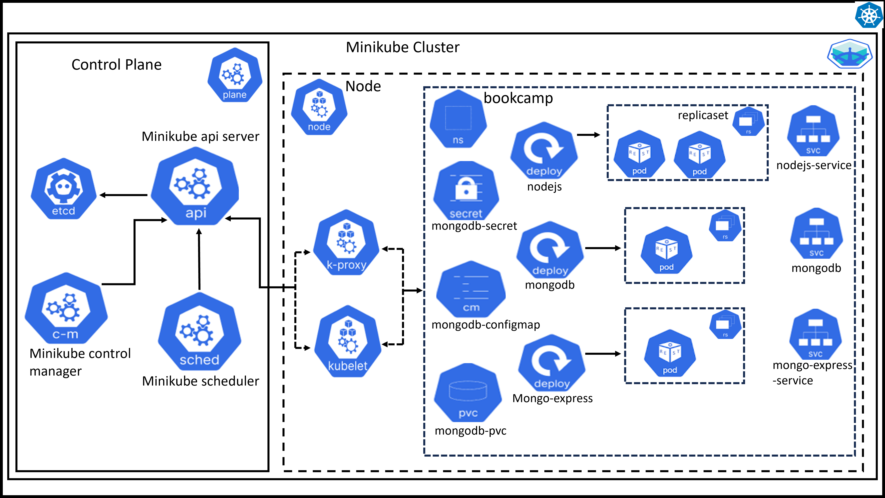
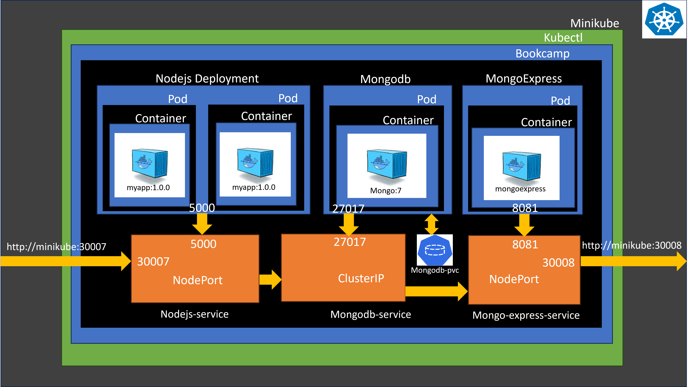
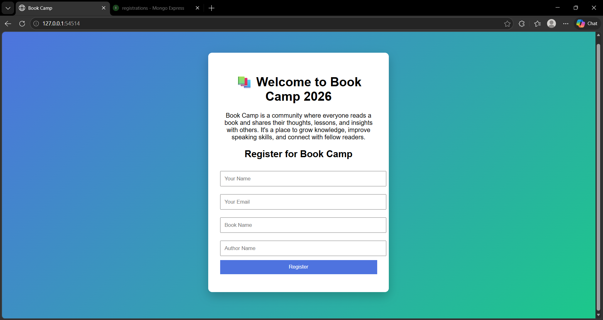
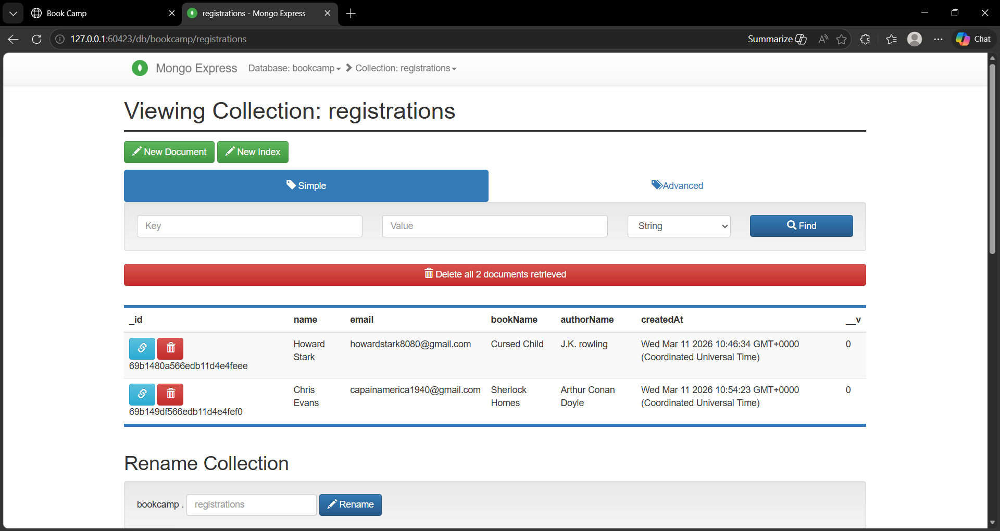

📚 BookCamp Kubernetes Deployment
A **containerized Node.js + MongoDB application deployed on Kubernetes** using **Minikube** for local development.
This project demonstrates a **real-world DevOps workflow** including Docker images, Kubernetes deployments, services, configuration management, and persistent storage.

---

# 🚀 Project Overview 
**BookCamp** is a simple Node.js application that stores user registrations in **MongoDB** and allows database management using **Mongo Express**.
This project shows how to deploy a **3-tier application architecture** in Kubernetes.

### Application Components 
| Component | Description | 
|---|---| 
| Node.js API | Main application server | 
| MongoDB | Database for storing registrations | 
| Mongo Express | Web UI for managing MongoDB | 
| Kubernetes | Container orchestration | 
| Minikube | Local Kubernetes cluster | 

---
  
# 📂 Project Structure 

```bash
bookcamp-k8s/
│
├── namespace.yaml
│
├── configmap.yaml
├── secret.yaml
│
├── mongodb-deployment.yaml
├── mongodb-service.yaml
│
├── nodejs-deployment.yaml
├── nodejs-service.yaml
│
├── mongoexpress-deployment.yaml
├── mongoexpress-service.yaml
│
├── storage.yaml
│
├── images
│     ├── architecture1.png
│     └── architecture2.png
│
├── screenshots
│     ├── output1.png
│     └── output2.png
│
├── Document.pdf
│
└── README.md 
``` 

---

# 🏗 Architecture

Kubernetes Architecture Diagram:



Kubernetes Architecture Flow:



---

# 📦 Kubernetes Resources

### Namespace Creates an isolated namespace for the project.
 ``` namespace.yaml ``` 

---

### ConfigMap Stores configuration values used by the application. 
Example: ``` MongoDB connection string Application environment variables ``` 
``` configmap.yaml ```

Note: change the MONGO_URL with your custom URL

---

### Secrets Stores sensitive data such as: 
``` MongoDB username MongoDB password Docker registry credentials ```
``` secret.yaml ``` 

Note: use base64 encoded values only

---

### MongoDB Deployment Deploys MongoDB container with persistent storage.
``` mongodb-deployment.yaml ```
Includes: - MongoDB container 
          - Persistent Volume Claim 
          - Secret-based authentication 

---

### MongoDB Service Creates an internal service so other pods can connect to MongoDB. 
``` mongodb-service.yaml ``` 
Service Type: ``` ClusterIP ``` 

---

### Node.js Deployment Deploys the BookCamp application.
``` nodejs-deployment.yaml ```
Features: - 2 replicas
          - environment variables from ConfigMap 
          - container port 5000 

---

### Node.js Service Exposes the Node.js application to external users.
``` nodejs-service.yaml ``` 
Service Type: ``` NodePort ``` 

---

### Mongo Express Deployment Provides a web UI to manage MongoDB.
``` mongoexpress-deployment.yaml ``` 

---

### Mongo Express Service Exposes Mongo Express UI. 
``` mongoexpress-service.yaml ``` 

---

### Persistent Storage Defines storage used by MongoDB.
``` storage.yaml ```
Uses: ``` PersistentVolumeClaim ``` 

---

# ⚙️ Prerequisites Make sure the following tools are installed: 
- Docker
- Kubernetes CLI (**kubectl**) 
- Minikube 
- Git 

---

# 🧑‍💻 Setup & Deployment 
### 1️⃣ Start Minikube 
``` minikube start ``` 

---

### 2️⃣ Create Namespace 
``` kubectl apply -f namespace.yaml ``` 

---

### 3️⃣ Create ConfigMap & Secrets 
```bash 
kubectl apply -f configmap.yaml 
kubectl apply -f secret.yaml 
``` 

---

### 4️⃣ Create Storage 
``` kubectl apply -f storage.yaml ``` 

---

### 5️⃣ Deploy MongoDB 
```bash
kubectl apply -f mongodb-deployment.yaml 
kubectl apply -f mongodb-service.yaml 
``` 

---

### 6️⃣ Deploy Node.js Application 
```bash
kubectl apply -f nodejs-deployment.yaml 
kubectl apply -f nodejs-service.yaml 
``` 

---

### 7️⃣ Deploy Mongo Express
 
``` bash
kubectl apply -f mongoexpress-deployment.yaml
kubectl apply -f mongoexpress-service.yaml
``` 

---

# 🔎 Verify Deployment Check pods: 
``` kubectl get pods -n bookcamp ``` 
Check services: ``` kubectl get svc -n bookcamp ``` 

---

# 🌐 Access the Application Get Minikube IP: 
```minikube service nodejs-service -n bookcamp```

Open new terminal

```minikube service mongo-express-service -n bookcamp```

default browsers will open the application 

or

``` minikube ip ``` 
### Node.js Application ``` http://<minikube-ip>:30007 ``` 
### Mongo Express UI ``` http://<minikube-ip>:30008 ``` 

---

### OUTPUT-Screenshots

Nodejs application:



Mongo-Express:



---

# 🛠 Useful Kubernetes Commands Check all resources: ``` kubectl get all -n bookcamp ``` 
View logs: ``` kubectl logs deployment/nodejs -n bookcamp ``` 
Describe pod: ``` kubectl describe pod <pod-name> -n bookcamp ``` 
Delete namespace and its components in it: ```kubectl delete namespace bookcamp```

---

# 📈 Future Improvements Possible enhancements for production environments: 
- Kubernetes Ingress 
- Horizontal Pod Autoscaler 
- Liveness & Readiness Probes 
- CI/CD pipeline 
- Helm Charts 
- Monitoring with Prometheus & Grafana 

---
 
# 📚 Learning Outcomes This project demonstrates: 
- Containerizing applications with Docker 
- Deploying applications in Kubernetes 
- Managing configuration using ConfigMaps & Secrets 
- Creating services for inter-pod communication 
- Using persistent storage for databases 
- Running Kubernetes locally using Minikube 

---

# 🤝 Contributing: Feel free to fork this repository and improve the project. 

---

### NOTE: foe detailed project overview see [Document.pdf](Document.pdf)

---

## Author:

M.Manikanta

Devops Engineer

https://github.com/maniSource-code

